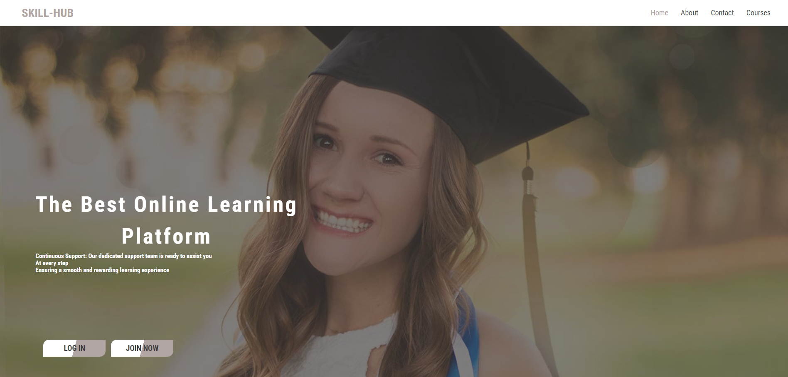
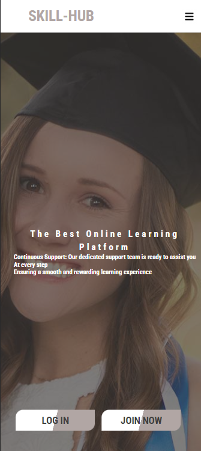

# SKILL-HUB

Welcome to [SKILL-HUB](https://skillhub.devmarc.tech/) a project crafted with love and dedication. Our mission extends beyond merely providing a product; we aspire to empower individuals by arming them with knowledge, information, and skills. Our ultimate goal is to contribute to the development of a talented generation, recognizing that knowledge and its application hold transformative power. Sharing what we've learned is not just a task; it's a manifestation of our passion and commitment, here is a [Blog](https://medium.com/@noransaber685/unveiling-skill-hub-empowering-learning-in-a-digital-era-a91969512cc9) about the project story

**In the development of this project**
we utilized HTML, CSS, JS, and Python (Flask). As junior developers, we encountered challenges such as responsiveness and deciding on the project's design. As the front-end developer, I made two valuable mistakes from which I've gained valuable insights
- Initially, I neglected to choose a template or specific design for our website, leading to extensive code rewriting. I've learned that establishing a template or standard shape before commencing work is crucial.
- The second mistake involved building entire pages before addressing responsiveness, resulting in significant time and effort spent on rectifying issues. This experience taught me the importance of building each section comprehensively before moving on to the next.

**Looking ahead, we have ambitious plans to enhance the website further:**
- Remove Vimeo videos
- Create and upload our videos
- Implement quizzes
- Introduce user profiles
- Enable course progress tracking
- Establish a section for tutors and instructors
- Incorporate chat features for learners to connect and learn collaboratively
- Encourage learners to share their knowledge through explanatory content.
- Our journey is a continuous learning process, and we are committed to evolving SKILL-HUB into a more advanced and enriching platform.

## Features
- **User Authentication:** Secure sign-up and login functionality for you
- **Course:** Easily can access the courses and start watching them.
- **Simple and eye-friendly website** SKILL-HUB where simplicity meets functionality! We've crafted an online experience that puts ease of use at the forefront, ensuring that every visitor can effortlessly navigate and enjoy their time here.
- **Responsive Design:** Access the platform seamlessly on various devices for a user-friendly experience.

## Getting Started
### Prerequisites
- [Python](https://www.python.org/)
- [Flask](https://flask.palletsprojects.com/)
- [dotenv](https://www.npmjs.com/package/dotenv)
- [Flask-bcrypt](https://pypi.org/project/Flask-Bcrypt/)
- [SQLAlchemy](https://www.sqlalchemy.org/)
- [Flask-cors](https://flask-cors.readthedocs.io/en/latest/)

### Installation
1. Clone the repository: `git clone https://github.com/Noransaber/pre-portfolio-propjet.git`
2. Navigate to the project directory: `cd pre-portfolio-propjet`
3. `python -m backend.flask_app.app`
4. Open your browser and go to `http://localhost:3000` to access the platform.

## Usage
1. **Sign Up/Log In:** Create an account or log in with your credentials.
- Click on the Join Now button

- Fill in the requirements and click on Create account
2. **Explore Courses:** Browse through available courses .

## Credit
This collaborative project was undertaken by a dynamic team comprising two skilled software engineers:
### Adebayo Aywale
- [GitHub](https://github.com/Oluwamarcellus )
- [Twitter](https://twitter.com/Hayyddex)
- [LinkedIn](https://www.linkedin.com/in/devmarc)
- [Haydexwisdom@gmail.com](mailto:Haydexwisdom@gmail.com)

  
### Noran Abdelfattah
- [GitHub](https://github.com/Noransaber?tab=repositories)
- [Twitter](https://twitter.com/Noransaber11)
- [LinkedIn](https://www.linkedin.com/in/noran-saber-abdelfattah-6198471ba/)
- [Medium](https://medium.com/@noransaber685)
- [noransaber685@gmail.com](mailto:noransaber685@gmail.com)

Additionally, this project was carried out under the supervision of [ALX Africa](https://www.alxafrica.com/).

## Contributing
We welcome contributions! If you'd like to contribute, please send us a Gmail
- noransaber685@gmail.com
- Haydexwisdom@gmail.com
* Clone repo and create a new branch: $ git checkout https://github.com/Noransaber/pre-portfolio-propjet.git -b name_for_new_branch.
* Make changes and test
* Submit a Pull Request with a comprehensive description of changes

## Contact
For questions or support, suggestion please contact us at
- [noransaber685@gmail.com](mailto:noransaber685@gmail.com)
- [Haydexwisdom@gmail.com](mailto:Haydexwisdom@gmail.com)
